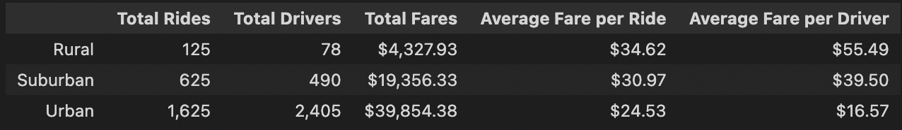
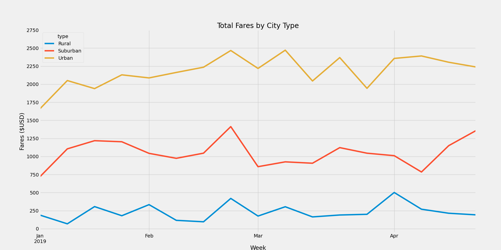

# PyBer Challenge

## Overview of the Analysis
The following analysis provides a summary of ride-sharing data by city type (Urban, Suburban, and Rural) along with a time-series analysis of total fares (in $USD) by city type for the timeframe from January 2019 through April 2019. This analysis can be used by PyBer's CEO to identify and address disparities among city types served by the PyBer business.

## Results
### Ride-sharing Summary by City Type

Based on the data we analyzed and summarized below, we can see clear differences between the types of cities we serve.

1. Urban cities have the highest demand for PyBer's service (1,625 rides in Urban cities compared to 625 in Suburban cities and only 125 in Rural cities.)
2. Urban cities also have the most drivers; in fact, there seem to be more drivers than rides provided over this timeframe in Urban cities.
3. Because of the differences between demand for rides and supply of drivers in each city type, Fares per Ride and Fares per Driver are highest in Rural areas and smallest in Urban areas.

### Fares by City Type by Week
Looking at the total fares by week over the January to April timeframe, we see fairly stable trends in total fares.  We may want to watch whether the upward trend in fares at the end of April in the Suburban cities continues or falls back towards the average.

## Summary
Given the above data and analysis, the following actions are recommended:
1. Evaluate the viability of continuing to serve Rural areas: total demand for ride-sharing is very low in the rural areas, and PyBer has very few drivers to support these areas. As a consequence fares per ride are high. A follow up customer satisfaction survey could be helpful to understand if customers would use the service more in fares were lower.  
2. Address the relative under-supply of drivers to Suburban and Rural areas:  Analyze the proximity of the well-served Urban areas to less well-served Suburban and Rural areas and use that analysis to communicate opportunties for higher fares to drivers currently serving the Urban areas.  This could ease supply shortages in Rural and Suburban areas, driving the fare per ride down, which our customers should like, and should also provide the Urban drivers with higher total Fares, which would hopefully compensate for any additional travel time they would experience.
3. Address demand in Urban areas:  Because PyBer seems to have a strong supply of drivers in the Urban areas, there may be opportunities through advertising to increase the number of rides provided by PyBer drivers and therefore increasing total Fares.
